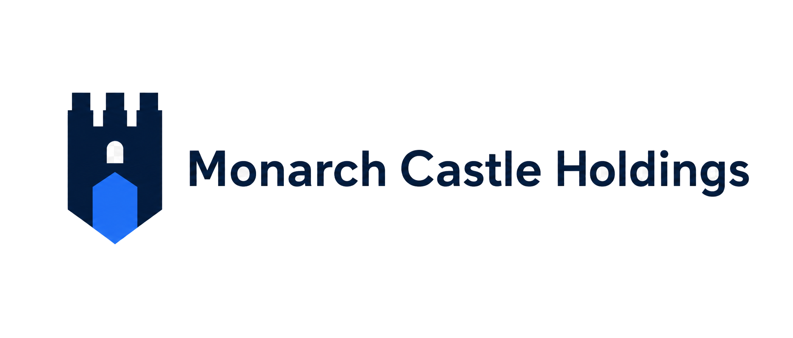

<div align="center">
  
  <!-- CODEX: generate the holding crest / wordmark logo here (logo.png) -->

# 🏰 Monarch Castle Holdings

**Turning open-source noise into lawful, verified, decision-grade intelligence.**

*The Palantir of Türkiye — sovereign decision-intelligence across threat, finance, energy, defense, and emergency domains.*


</div>

---

## 🏛️ The Group

Monarch Castle Holdings is a **holding company** over two operating subsidiaries, each run as its own organization.

| Subsidiary | Focus | Organization |
|---|---|---|
| 🛰️ **Strategic Data Company of Ankara** | Threat-intelligence indices | **[@SDCofA](https://github.com/SDCofA)** |
| ⚙️ **Monarch Castle Technologies** | OSINT product company · 5 intelligence divisions | **[@monarchcastletech](https://github.com/monarchcastletech)** |

```
Monarch Castle Holdings
├── Strategic Data Company of Ankara   →  BNTI · WTI · MENA
└── Monarch Castle Technologies        →  Emergency · Financial · Defense · Energy · Sectoral Intelligence
```

---

## 📐 Doctrine

- **Evidence before assertion** — every score, alert, and claim ships with its source and collection timestamp. No un-provenanced numbers, ever.
- **Lawful collection only** — open, public sources; access controls and data-protection law (KVKK / GDPR) honored.
- **Reproducibility** — every pipeline re-runs from a clean checkout.

<div align="center"><sub>🏰 Monarch Castle Holdings · Ankara, Türkiye · est. 2026</sub></div>
